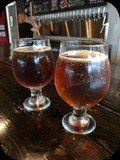

## Craft Beer Study  

*Steve Bramhall, Lei Jiang*

#### The purpose of this project is to emulate a real world data science project that requires the following:
- teamwork
- data merging and munging
- statistical analysis in Rstudio
- well documented code (using R-Markdown)
- source code control via Github
- written communication
- verbal communication 

#### The project used information about 2410 craft beers and 558 breweries in the U.S. The study provides interesting insights and discussions that include the analysis and coding methods used in the analysis. A link to the verbal presentations can be found at the bottom of the R-Markdown file.

### CODEBOOK

#### PROJECT FILES
* .gitignore - lists local files specific to the team member, version control not needed
* MSDS6306CaseStudy1.Rproj - Rstudio project file
* BeerStudy.Rmd - main program
* BeerStudy.html - html output from the main program

#### INPUT FILES: (Folder = ImportFiles)
1. Beers.csv - information about 2410 craft beers
2. Breweries.csv - information about 558 breweries
3. statesmostbreweriesperperson2.jpg - U.S. Map showing the most breweries per person

#### OUTPUT FILES: (Folder = OutputFiles)
* NA, used for debugging during code development

#### LIBRARIES
* dplyr - for string functions
* ggplot2 - for plots
* kableExtra - for table formatting
* knitr - for presenting in html

#### DEFINITIONS
* ABV - Alcohol by volume of the beer.
* IBU - International Bitterness Units of the beer.

#### VARIABLES
##### beerDF - *data frame of beer data from csv file*
##### breweryDF - *data frame of beer data from csv file*
##### breweryStateCnt - *data frame of grouped brewery counts by state*
##### brewerySummaryDF - *data frame of the summary data of brewery counts by state*
##### allBeerDataDF - *data frame containing the merged beer data and brewery data*
##### naCountDF - *data frame containing the NA counts for each variable in allBeerDataDF*
##### medianABV - *data frame containing the median alcohol by volume per state*
##### medianIBU - *data frame containing the median International Bitterness Units per state*
##### medianBeerData - *data frame containingthe merged medianAVB and medianIBU*
##### meanABV - *mean alcohol by volume, NA's ignored*
##### scatterplot - *geom_point ggplot of ABV vs IBU*

#### OTHER
##### In codes chunks where plots are built, warnings are turned off to clean up the messaging. The warnings state data with empty values were excluded in the plots. This is desired and intentional.

#### Workload
Introduction and Conclusion
DRAFT: Steve
REVISIONS: Lei and Steve

R Code and Comments for Questions 1, 3, and 7
PRIMARY: Lei
REVISIONS: Steve

R Code and Comments for Questions 2, 4, and 5
PRIMARY: Steve
REVISIONS: Lei

R Code and Comments for Questions 6
INITIAL: Lei and Steve
FINAL: Lei and Steve

File Structure
INITIAL: Lei and Steve
FINAL: Lei and Steve

Readme
INITIAL: Lei
FINAL: Lei and Steve

Powerpoint slides
INITIAL: Lei 
FINAL: Lei and Steve

Presentations
Completed Individually

#### Lei worked on the R code for Fig 1. number of breweries by state, Fig 5. correlation of ABV and IBU, and used kable to give nicer output for all the tables.  (And also the code for finding Pearson correlation coefficient although it is not required). And suggested using data of past sales of beers to find best ABV and IBU range to invest and getting customer survey data for recommendation part. 
#### Steve worked on R Code for merging the data, Fig 2 median ABV by state, Fig 3 median IBU by state and major part of writing on Introduction, Comments, and Conclusion. And suggested that host/partner events and promotions to collect our own data Analyze population trends and review brewery/alcohol laws. Steve also initiated sitting up the Rstudio project to Github. 
#### We worked together on boxplot for ABV summary,and drawing conlusions. Lei provided the template for powerpoint slides, Steve provided important suggestions and revisions.

